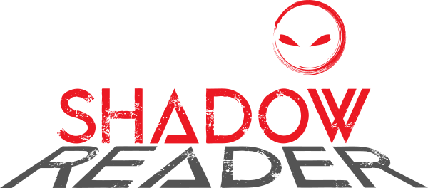
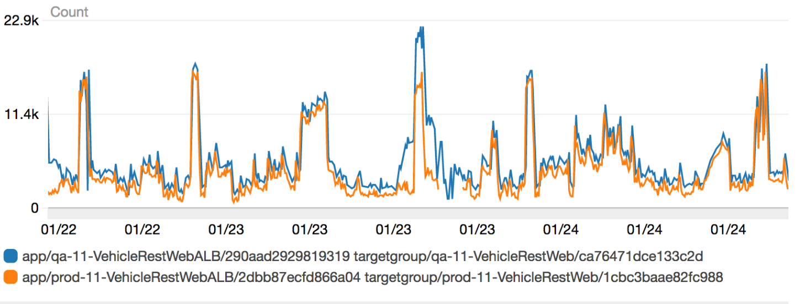
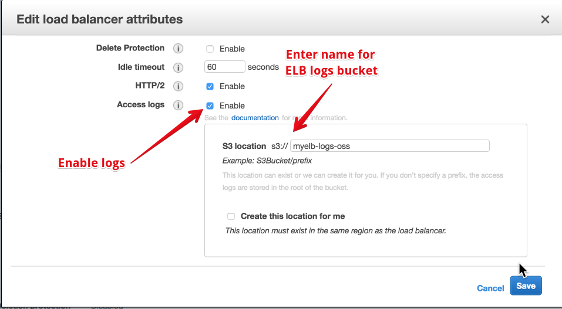
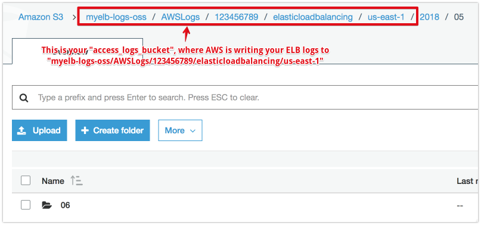
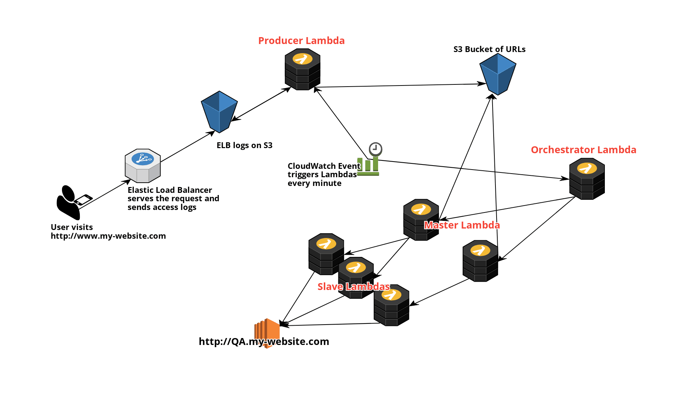

# Shadowreader



> Serverless load testing system for replaying production traffic into testing environments.

Shadowreader has the ability to replay production traffic to a destination of your choice by collecting traffic patterns from ELB logs. It is built on AWS Lambda, S3 and Elastic Load Balancers.



In the chart above, the blue line is the request rate of Shadowreader while in orange is the load on the production website. Shadowreader throughput closely mimics real user traffic.

Support for Python3.6+

Support for Application Load Balancers (Classic Load Balancers support planned)

# Quick start

## 1. serverless.yml set up

Copy the contents of `shadowreader/serverless.example.yml` and use it to create new file `shadowreader/serverless.yml`. Then update the variables listed below.

Both `serverless.yml` and `shadowreader.yml` must be configured before deployment via Serverless.

```
# Required. This is your project name. It is to ensure that the S3 bucket used by Shadowreader has unique naming.
custom:
  my_project_name: my-unique-project-name
```

```
# Required.
# "test_params" variable is a JSON that specifies the parameters for the load test.
# All values except "identifier" must be properly configured.
# Values below are examples

orchestrator-past:
  handler: functions/orchestrator_past.lambda_handler
  events:
    - schedule: rate(1 minute)
  environment:
    test_params: '{
                    "base_url": "http://www.mywebsite.com",
                    "rate": 100,
                    "replay_start_time": "2018-4-2-15-40",
                    "loop_duration": 60,
                    "identifier": "oss"
                }'

# "base_url" - Here, you can specify the base URL that will be load tested.
# "rate" - A percentage value at which Shadowreader will perform the load test.
#          It accepts a float value larger than 0
# "replay_start_time" - Shadowreader replays traffic from certain time periods for its load tests.
#                       This is the starting time for the replay period.
#                       If Shadowreader has not collected data for this time period,
#                       it will not run.
# "loop_duration" - This is an integer value, denominated in minutes.
#                   It is how long the replay period will be,
#                   starting from the time specified in "replay_start_time"
#                   For example, if "replay_start_time" = "2018-1-1-10-0" and "loop_duration" = 60,
#                   then it will replay traffic from 2018/1/1 10AM to 2018/1/1 11AM
# "identifier" - This is an identifier that is used when tagging CloudWatch metrics. Editing it is optional.
```

```
# Optional. If you are testing inside a VPC, these must be set to give Shadowreader VPC access.
vpc:
  securityGroupIds:
    - sg-your-security-group-id
  subnetIds:
    - subnet-your-subnet-1
    - subnet-your-subnet-2
```

## 2. shadowreader.yml set up

Copy the contents of `shadowreader/shadowreader.example.yml` and use it to create file `shadowreader/shadowreader.yml`

```
# Required. This variable must be set according to where your ELB logs are being written to.
# See screenshots below for help in finding this.
environment:
    access_logs_bucket: AWSLogs/123456789/elasticloadbalancing
```

### Enabling ELB logs



### Finding your access_logs_bucket and path



## 3. Install the Serverless framework

```sh
# Install the serverless cli
npm install -g serverless

# In-depth guide for installing Serverless framework:
# https://serverless.com/framework/docs/getting-started/

# Install the Serverless plugin which will pack necessary Python libraries
serverless plugin install -n serverless-python-requirements
```

## 4. Deploy to AWS

```
# Deploy Shadowreader to your AWS account
serverless deploy --stage dev --region region_of_your_choice
```

## Architecture



## Usage example

Shadowreader can be used for performance testing applications.

For monitoring results, the recommended way is to create CloudWatch dashboards that display metrics such as RequestCount, TargetResponseTime and CPU/MEM Utilization

By comparing status codes and latency between the original request and replayed request, its possible to detect defects before they are shipped to production.

## Contributing

Please see the [contributing guide](CONTRIBUTING.md) for more specifics.

## Authors

[Yuki Sawa](https://github.com/ysawa0) – ysawa@edmunds.com

## License

Distributed under the Apache License 2.0. See [`LICENSE`](LICENSE) for more information.
